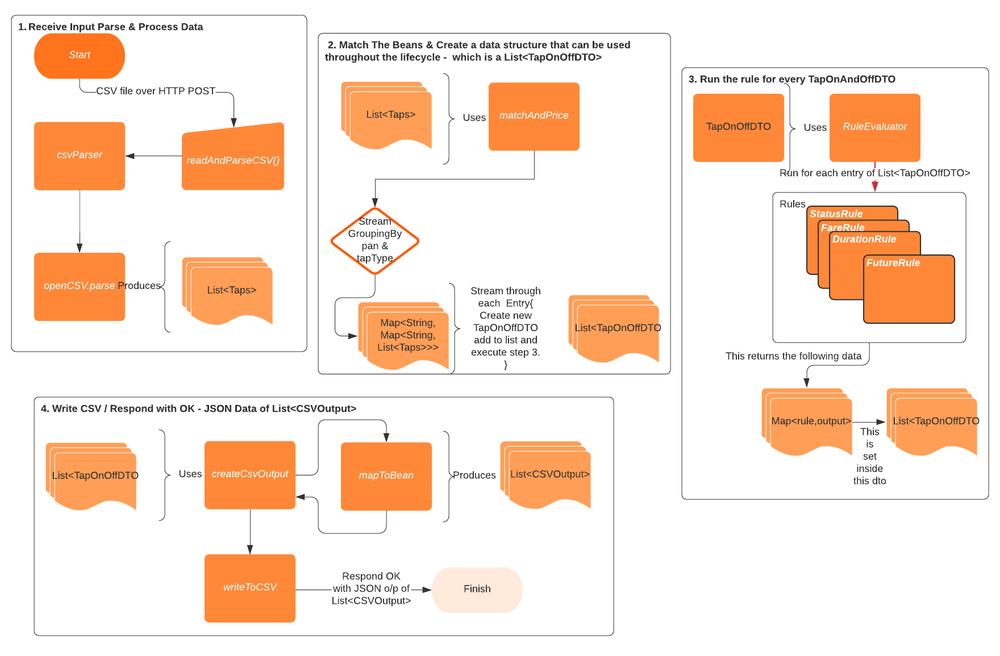

# Fare Calculator

## Prerequisites
1. Java 8
2. Maven 3.8.4
3. Git Bash
4. Require access to C Drive to create C:\tmp

## Maven Commands

### How to setup this project.

1. Run install
```
mvn clean install
```
2. Tets run as part of install, to explicitly Run tests
```
mvn clean test
```
### You can start-up the project in different ways. 
1. Run as spring-boot application
```
mvn clean spring-boot:run
```
2. To compile and run the project as a jar file, you will need to 

- Create a fatjar
```
mvn clean package
```
3. Run the fatjar in cmd or bash

Run using fatjar bash
```
$ java -jar /f/development/poc/fare-calculator-poc/fare-calculator/target/fare-calculator-0.0.1-SNAPSHOT.jar
```

Run using fatjar cmd
```
C:\Users\samhita>java -jar F:\development\poc\fare-calculator-poc\fare-calculator\target\fare-calculator-0.0.1-SNAPSHOT.jar
```

## Curl Commands

### How to process a csv file and view the output.
The input csv is taps.csv found inside the resources folder. This file can be sent through either of the following curl commands:

1. Method to upload csv (assumes that you are in the resources folder and taps.csv is available)
````
curl -v -F file=@taps.csv http://localhost:8080/api/csv/upload
````
2. Method to upload csv using bash path
````
curl -v -F file=@/f/development/poc/fare-calculator-poc/fare-calculator/src/main/resources/taps.csv http://localhost:8080/api/csv/upload
````
Test get method
````
curl http://localhost:8080/api/csv/test
````

### Output file
1. You will find the processed csv output under C:\tmp
2. You can also see the output printed as a json on the console.

###Sample output
```
samhita@ /f/development/poc/fare-calculator-poc/fare-calculator (main)
$ curl -v -F file=@/f/development/poc/fare-calculator-poc/fare-calculator/src/main/resources/taps.csv http://localhost:8081/api/csv/upload
* timeout on name lookup is not supported
*   Trying ::1...
  % Total    % Received % Xferd  Average Speed   Time    Time     Time  Current
                                 Dload  Upload   Total   Spent    Left  Speed
  0     0    0     0    0     0      0      0 --:--:-- --:--:-- --:--:--     0* Connected to localhost (::1) port 8081 (#0)
> POST /api/csv/upload HTTP/1.1
> Host: localhost:8081
> User-Agent: curl/7.49.1
> Accept: */*
> Content-Length: 603
> Expect: 100-continue
> Content-Type: multipart/form-data; boundary=------------------------9ca2695c90f776ee
>
< HTTP/1.1 100
} [152 bytes data]
< HTTP/1.1 200
< Content-Type: application/json
< Transfer-Encoding: chunked
< Date: Tue, 30 Nov 2021 23:56:54 GMT
<
{ [680 bytes data]
100  1276    0   673  100   603   1346   1206 --:--:-- --:--:-- --:--:--  1346
[
  {
    "started": "2018-01-22T13:00:00",
    "finished": "2018-01-22T13:05:00",
    "durationSecs": 300000,
    "fromStopId": "Stop2",
    "toStopId": "Stop1",
    "chargeAmount": 3.25,
    "companyId": "Company1",
    "busID": "Bus37",
    "pan": "5500005555555559",
    "status": "COMPLETE"
  },
  {
    "started": "2018-01-24T11:10:00",
    "finished": null,
    "durationSecs": 0,
    "fromStopId": "Stop2",
    "toStopId": null,
    "chargeAmount": 5.5,
    "companyId": "Company1",
    "busID": "Bus37",
    "pan": "34343434343434",
    "status": "INCOMPLETE"
  },
  {
    "started": "2018-01-23T10:05:00",
    "finished": "2018-01-23T10:10:00",
    "durationSecs": 300000,
    "fromStopId": "Stop2",
    "toStopId": "Stop2",
    "chargeAmount": 0.0,
    "companyId": "Company1",
    "busID": "Bus37",
    "pan": "122000000000003",
    "status": "CANCELLED"
  }
]
* Connection #0 to host localhost left intact

```

## Assumptions
1. That the input file is well-formed and is not missing data and validated.
2. File will be sent over REST http POST.
3. That it's a single Bus and Company.
4. Stops have equivalent numeric keys which are mapped in the application.yml.
5. Rate is being calculated from a cost matrix, which is configured in application.yml
6. Covers few scenarios, mostly happy path in integration testing.

## TODO's
1.Validation of data.
2. More test cases around integration and Rules unit tests.
3. Exception Handling.
4. Builder pattern.
5. IOC normalizing across project.
6. Adding class level comments.
7. TODO's in code level.
8. Basic flow and Architecture Diagrams.
9. Currently using public modifiers, this need to be updated.

## Project Flow and Structure and Specifications
1. The FareCalculatorApplication is the entry point for the application where it loads the profile from application.yml.
2. Loads all the components and instantiates the classes once complete, it listens on port 8081 for csv files.
3. The FareCalculatorController receives the input csv file over POST call for "/api/csv/upload" api.
4. The controller calls AggregatorService to get matchAndPrice.

### Flow


## Known Issues
1. Headers seem to disappear when ordered using position annotation in output.csv